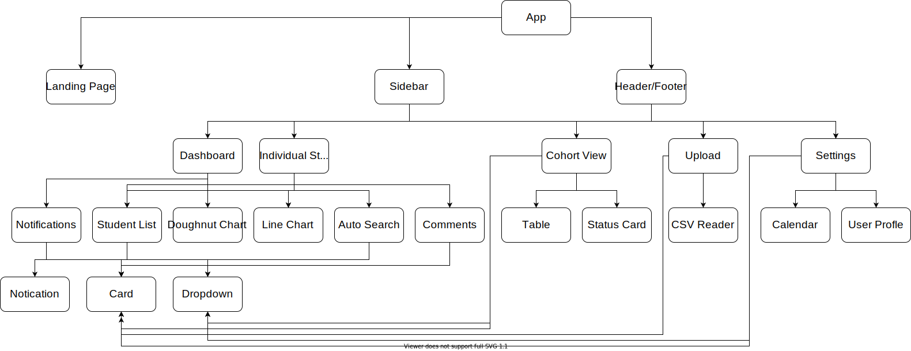

# DEMETER DASHBOARD OVERVIEW

Demeter is a platform which was created to as part of our final project at School of Code. The aim of our project was to create an app which the coaches at [School of Code](https://www.schoolofcode.co.uk/) can use to keep track of student work submitted. The app will enable them to see an overview of the students performance all in one place.

## Contents

1. [Description of Demeter](#description-of-demeter)
2. [Strategy](#strategy)
3. [Stack Used](#stack-used)
4. [Application Architecture](#application-architecture)
5. [Meet Phantom Elephants](#meet-phantom-elephants)

## Description of Demeter

The data which will be displayed on the Demeter Dashboard includes:

- Bootcamp
- Region
- Workshop scores
- Feedback
- Daily quizzes
- Attendance
- Reflections
- Mood based on their reflections

We decided to use a dashboard from Creative Tim which used Tailwind CSS. On this dashboard we decided to have 4 pages:

_*Main dashboard*_

- On this page we have colour coordinated alerts which are placed on the main dashboard to make it more convenient for the coaches to identify students that are struggling as well as students that are excelling.
  We also have a :
- Student watch list
- overall view of experience and quiz scores
- Overall view of Attendance

_*Cohort View*_

- On this page there is a cohort table in which the students can be filtered based on the region of their bootcamp.
- The list of students on the table can also be filtered by a watch list

_*Individual Student View*_

- This page enables the coaches to view the detailed progress of specific students as well as their attendance and contact details.
- We also added a comments component which allows coaches to leave feedback for their colleagues that may visit that students page.

_*File Upload*_

- On this next page we have made it possible for the user to upload relevant files such as a new work completed by the students as well as files regarding new students or bootcamps that need to be added to the database.

_*Settings*_

- On the last page we have a user settings page which allows the user to personalise their page by adding their name and region. It also gives them the option to upload a photo

- Another feature which was implemented based on the user feedback received was the ability for the user to set a default bootcamp and set a comparison period, which is then reflected on the main dashboard.

We have also implemented Auth0 because it provides user-specific dashboards for the bootcamp coaches based upon user logins and it helps maintain the privacy of the student data.

## STRATEGY

We aimed to work using a Agile methodology whilst keeping the app users as the main focus of development.

Throughout this project all members of the Phantom Elephants worked on both the frontend and backend.

We brain stormed a few ideas about what we thought our users (SOC coaches) would like to see on the Demeter Dashboard and then we asked a couple coaches to join us in a focus meeting which allowed us to further explore this. One of the feedback we received from the coaches included having a notification / or alert system which would help them see the progress of the students. We took on this feedback and made sure to include it in our application

As a team we also decided to use Figma to create our wireframes this was beneficial as it allowed the team to visualise our application and it highlighted the different components needed for our app. We then used draw.io to map out all our components and break down our data structures.

## STACK USED

- REACT
- MATERIAL TAILWIND
- SEMANTIC UI
- CREATIVE TIM

Front-end deployed on AWS Amplify!

## Application Architecture

## Meet Phantom Elephants

### [Juweyriya Abdikadir](https://github.com/Juweyriya)

### [Lizard Morrow](https://github.com/onlyasmalllizard)

Fullstack developer who plays too many instruments 🎻

### James Perrett

Hi! I'm [James](https://github.com/PerrettJ4), I am a full stack Software Engineer with a Masters in mechanical Engingeering. Check out my [website!](https://perrettj4.netlify.app/)

### Mohit Sharma

Mohit, you knows it.

Click the link below to exit

[Exit](https://github.com/Ratmsunny)
